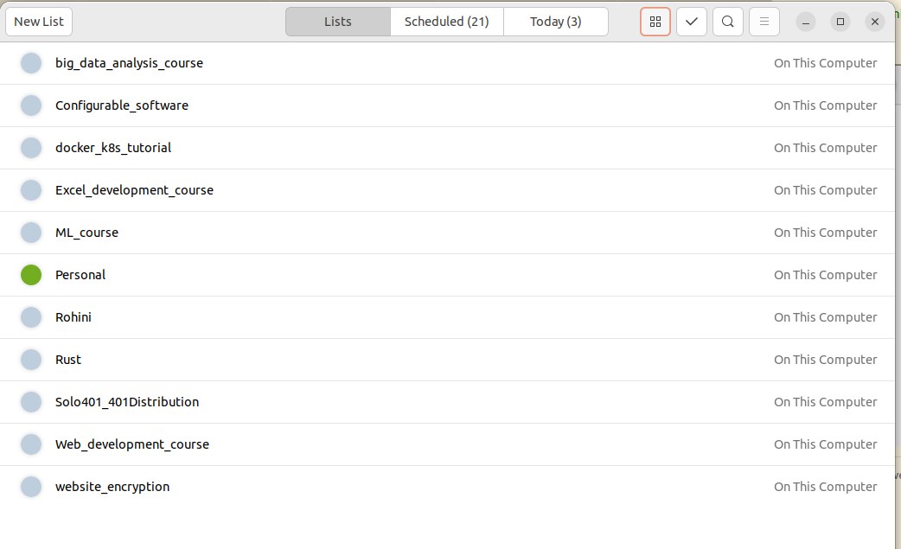
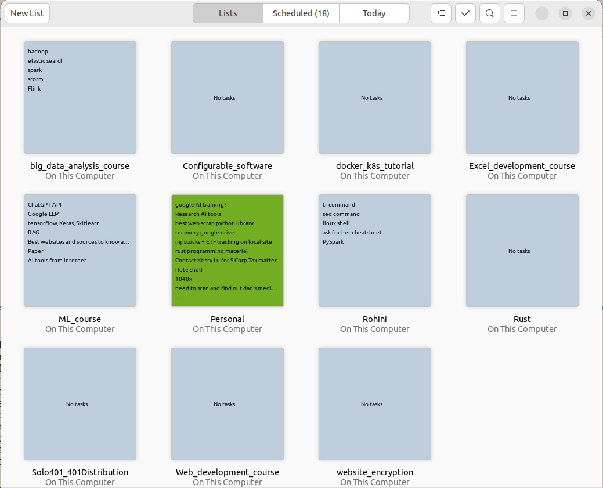
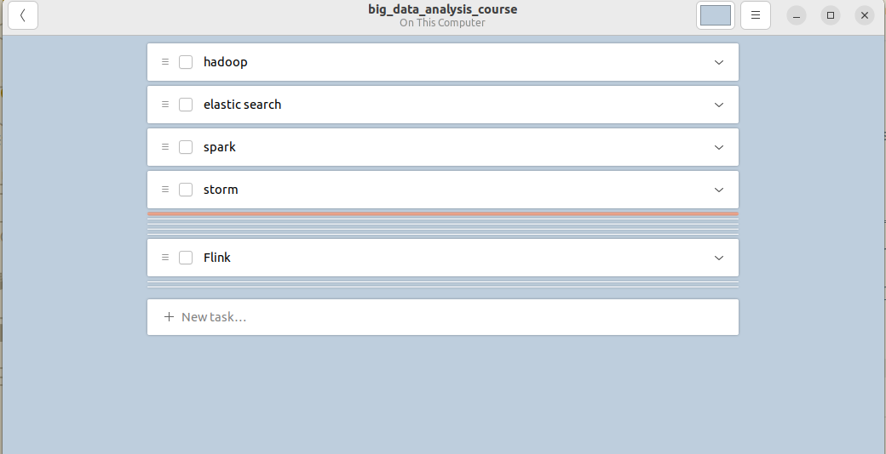
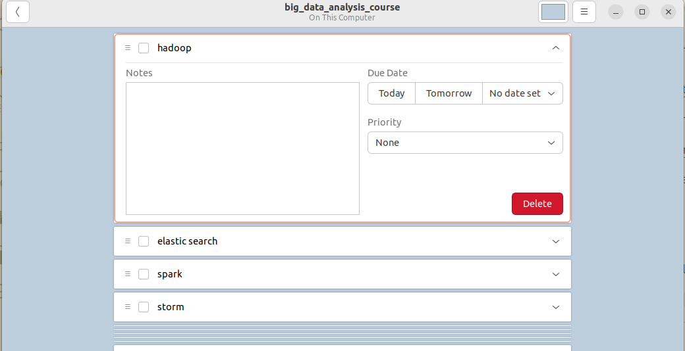
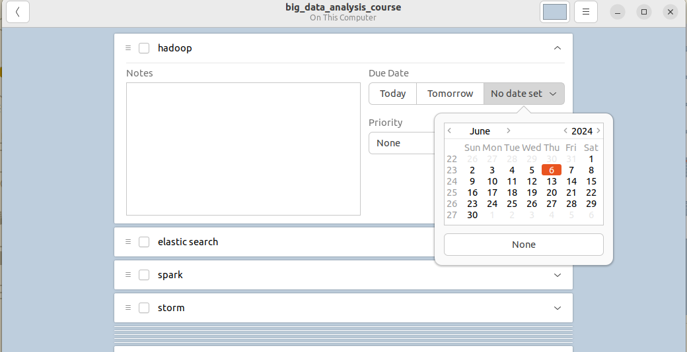

# Midterm Project

## Introduction

This is a software development project and the result will be used as our mid-term project score. The goal is to develop backend service, a microservice to serve the UI service to render an html form to implement a web version or mobile version software system, an clone of the software called “gnome-todo”.

Some background of “gnome-todo”. It is an opensource task management system. So it allows you to create a list, which is a set of tasks to track certain epic/story.

## UI and features

* The concept of `lists`

The following image is a `list view` of all the lists. We can have many lists.
A list is like a story in Jira system.

The following image is a `thumbnail view` of all the lists.

A list is a set of tasks. When we open a list called "big_data_analysis_course"

* The concept of task

When we click into in each task, we can see the following,

The `today` and `tomorrow` are shortcut, and it is convinient for user, but in database we normally just allow user to store a daytime stamp (a database data type),

* Mark task completed

When you check the checkbox in front of each task. Then the task will disappear and move to the `done` bucket.
`done` bucket is just a UI thing, which from SQL perspective, it is just a query to get a list of tasks that has been marked as done.

## Databases Design

With all the above descriptions, and business requirement, we could actually depict some table drafts like the ones below,

**Task table**

|t_id (int, auto_increment) | title(string) | Note (text)| due_day(datetime)| list_id (integer) |priority(enum)| completed|
|-------------------------- |---------------|------------|-----------------|--------------------|--------------|-------|
|                           |               |            |                 |                    |              |       |

**List table**

|list_id|list_name|
|-------|---------|
|       |         |

## What You Need to Do

* API Design
* API Development

Requirements:

* For API design, we need to write down some specification. Here is a commercial API documentation provided by mailchimp,

https://mailchimp.com/developer/marketing/api/lists/get-lists-info/

You can learn more from the side bar and see how the API was written and documented.

* For API development and implementation, we could use the mysql code project from spring.io from our #2 class as a boilerplate.

* We need to have basic operation for CURD (a database course jargon), which means `create`, `update`, `read`, `delete`.

Similarly, `create` is `HTTP POST`, `update` is `HTTP PUT`, `read` is `HTTP GET` and `delete` is `HTTP DELETE`.

We need to distinguish `path variable` from `url parameter` and how to get them from Springboot way using different annotations. Please google it if you need.

* Please well document all the APIs you write.
In your document you should also take screenshot to prove your code is running for each API.

* If you can write tests, extra bonous.

* API should have the features of,

0/ create a list

1/ create a task

2/ mark task complete

3/ update the task if after the task has been created.

4/ delete the task.

5/ a query to find all the tasks that have been completed.

6/ a query to find out all the tasks that have been scheduled to tomorrow based on your system time.

7/ a query to find out all the tasks that have been scheduled to today.

8/ Priority should be created as enum in database.

9/ A query to find all the tasks information based on the priority.

10/ All the output including POST or PUT should return json and proper http status code, such as 200, 202...etc.

## In your word document

You should include screenshots. You could use curl or postman for all the API tests.

### API references

For the api naming pratices, I will list the following websites, which might help you learn restful api naming,

- https://restfulapi.net/

- https://betterprogramming.pub/restful-api-design-step-by-step-guide-2f2c9f9fcdbf

- https://blog.restcase.com/5-basic-rest-api-design-guidelines/

