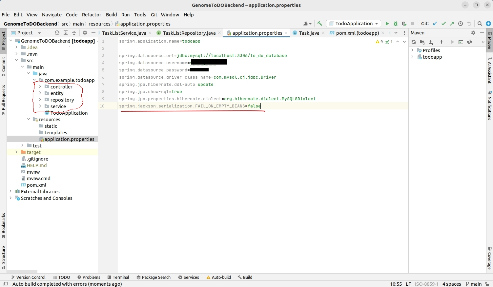

# Java Enterprise Development with Springboot - Topic 5 - More on Spring Data, JPA, JPQL and Lombok

## Part I Warm up with a previous JPA data project

In the #2 class, we have a lab to show you how to run the example from springboot.io about the connection to MySQL database.
In today's first part, we would like to review that project, and pay attention to a few points that project was using,
and we will extend it a little bit to the following topics that we would like to cover in this section.

* JPA's CrudRepository and JPARepository
* JPQL
* Lombak

### Get Springboot configured with MySQL

* Prerequisite: mysql installation and configuration. Refer to our #2 class lab about MySQL access with Springboot.

* git clone https://github.com/spring-guides/gs-accessing-data-jpa.git

* cd into gs-accessing-data-jpa/complete(please skip the initial directory).

* Make sure the resource file called `src/main/resources/application.properties` contains the following,

```java
spring.jpa.generate-ddl=true
spring.jpa.hibernate.ddl-auto=create
spring.jpa.show-sql=true
spring.datasource.url=jdbc:mysql://localhost:3306/db_example
spring.datasource.username=springuser
spring.datasource.password=ThePassword
#spring.datasource.driver-class-name=com.mysql.cj.jdbc.Driver
```

Spring Data JPA focuses on using JPA to store data in a relational database. Its most compelling feature is the ability to create repository implementations automatically, at runtime, from a repository interface.

To see how this works, create a repository interface that works with Customer entities as the following listing (in src/main/java/com/example/accessingdatajpa/CustomerRepository.java) shows:

```java
package com.example.accessingdatajpa;

import java.util.List;
import org.springframework.data.repository.CrudRepository;

public interface CustomerRepository extends CrudRepository<Customer, Long> {

  List<Customer> findByLastName(String lastName);

  Customer findById(long id);
}
```

Next add the following part into the above class,

```java
@Bean
  public CommandLineRunner demo(CustomerRepository repository) {
    return (args) -> {
      // save a few customers
      repository.save(new Customer("Jack", "Bauer"));
      repository.save(new Customer("Chloe", "O'Brian"));
      repository.save(new Customer("Kim", "Bauer"));
      repository.save(new Customer("David", "Palmer"));
      repository.save(new Customer("Michelle", "Dessler"));

      // fetch all customers
      log.info("Customers found with findAll():");
      log.info("-------------------------------");
      repository.findAll().forEach(customer -> {
        log.info(customer.toString());
      });
      log.info("");

      // fetch an individual customer by ID
      Customer customer = repository.findById(1L);
      log.info("Customer found with findById(1L):");
      log.info("--------------------------------");
      log.info(customer.toString());
      log.info("");

      // fetch customers by last name
      log.info("Customer found with findByLastName('Bauer'):");
      log.info("--------------------------------------------");
      repository.findByLastName("Bauer").forEach(bauer -> {
        log.info(bauer.toString());
      });
      log.info("");
    };
  }
```

### Build an executable JAR

`./mvnw clean package`

### Run the executable JAR

`./mvnw spring-boot:run`

When you run your application, you should see output similar to the following:

```bash
== Customers found with findAll():
Customer[id=1, firstName='Jack', lastName='Bauer']
Customer[id=2, firstName='Chloe', lastName='O'Brian']
Customer[id=3, firstName='Kim', lastName='Bauer']
Customer[id=4, firstName='David', lastName='Palmer']
Customer[id=5, firstName='Michelle', lastName='Dessler']

== Customer found with findById(1L):
Customer[id=1, firstName='Jack', lastName='Bauer']

== Customer found with findByLastName('Bauer'):
Customer[id=1, firstName='Jack', lastName='Bauer']
Customer[id=3, firstName='Kim', lastName='Bauer']
```

Now let us take a break here and pay attention to the `CustomerRepository` class which is the core of this entire session,
the magic is the above class file is an `interface` that **extends** another built-in interface called `CrudRepository`.

Without writting any real code implementation, this low-code idea allows us to write some function signature here using snake case.
`findByLastName` and `findById`. Note here, one database column is really called "id" and the other one is no doubt called "LastName".
When you did that, it will have the code generation or follow these schema meta information from the naming of the methods 
to retrieve the builtin database query for you without writing a lot of code. (This is the low-code and no-code concept.)

and if we recall how those were defined, they were defined like the following,

```java
@Entity
public class Customer {

	@Id
	@GeneratedValue(strategy=GenerationType.AUTO)
	private Long id;
	private String firstName;
	private String lastName;
```

## JPARepository Usage

In this project, I am going to show you a project that is based on the above project but I tuned it a little bit to show you
the code you should base on for your midterm project.

Of course there are many ways to achieve the midterm project. There are many database connection libraries and
connection technologies to achieve the goal that you could write some queries.
JPARepository is one of them. Here in the following explanation, I will show you using 
`JPARepository` to write a native query so you could take advantage of writing native sql query and to use the 
default builtin queries as well.




